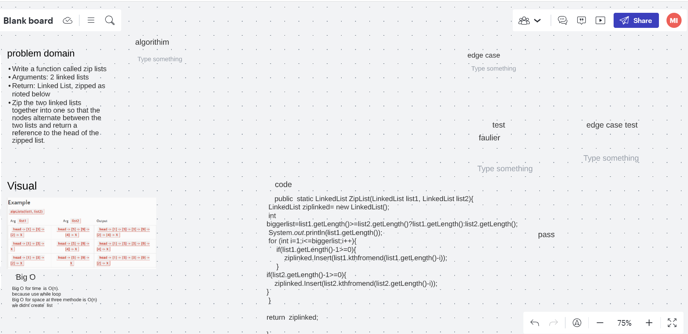

# Challenge Summary
Write a function called zip lists
Arguments: 2 linked lists
Return: Linked List, zipped as noted below
Zip the two linked lists together into one so that the nodes alternate between the two lists and return a reference to the head of the zipped list

## Whiteboard Process

## Approach & Efficiency
Big O for time  is O(n)
because use while loop
Big O for space at three methode is O(n)
we didnt create  list 

## Solution

 
## link
https://github.com/Maiada-Ibrahim/data-structures-and-algorithms-401/tree/main/testchallange/challange-07