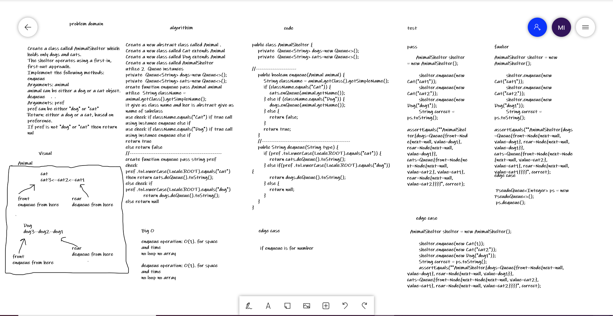

# Challenge Summary
Create a class called AnimalShelter which holds only dogs and cats.
The shelter operates using a first-in, first-out approach.
Implement the following methods:
enqueue
Arguments: animal
animal can be either a dog or a cat object.
dequeue
Arguments: pref
pref can be either "dog" or "cat"
Return: either a dog or a cat, based on preference.
If pref is not "dog" or "cat" then return nul

## Whiteboard Process
 

## Approach & Efficiency
deQueue(q):Big O is : O(1).
enqueue : Big O is : O(1).

## Solution
Create a new abstract class called Animal .
Create a new class called Cat extends Animal
Create a new class called Dog extends Animal
Create a new class called AnimalShelter .
utilize 2  Queue instances 
and use them to find solution

## link
[link for code](https://github.com/Maiada-Ibrahim/data-structures-and-algorithms-401/tree/main/challenges/challenge-10)