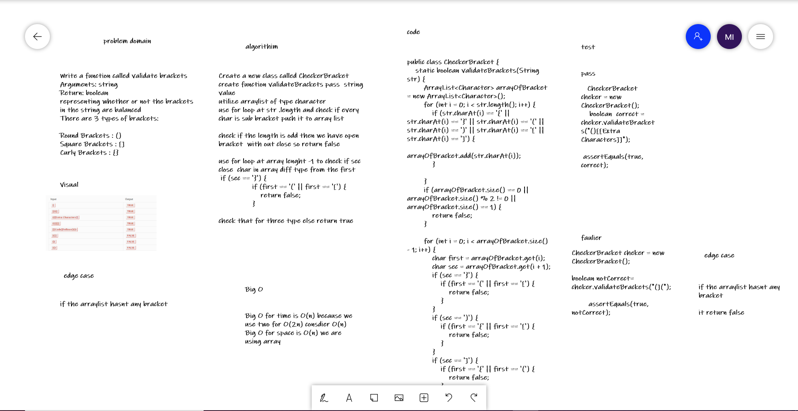

# Challenge Summary
Write a function called validate brackets
Arguments: string
Return: boolean
representing whether or not the brackets in the string are balanced
There are 3 types of brackets:

Round Brackets : ()
Square Brackets : []
Curly Brackets : {}

## Whiteboard Process
 

## Approach & Efficiency
Big O for time is O(n) because we use two for O(2n) consdier O(n)
Big O for space is O(n) we are using array

## Solution
utilize arraylist of type character 
use for loop at str .length and check if every  char is sub bracket puch it to array list 

check if the length is odd then we have open bracket  with out close so return false

use for loop at array lenght -1 to check if sec close  char in array diff type from the first 

      if (sec == '}') {
                if (first == '(' || first == '[') {
                    return false;
                }

check that for three type else return true

## link
[link for code](https://github.com/Maiada-Ibrahim/data-structures-and-algorithms-401/tree/main/challenges/challenge-10)