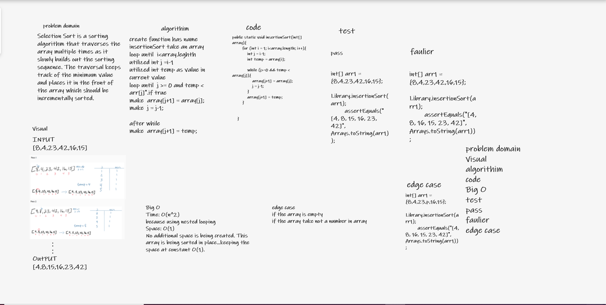

# Challenge Summary
Review the pseudocode below, then trace the algorithm by stepping through the process with the provided sample array.

 InsertionSort(int[] arr)

    FOR i = 1 to arr.length

      int j <-- i - 1
      int temp <-- arr[i]

      WHILE j >= 0 AND temp < arr[j]
        arr[j + 1] <-- arr[j]
        j <-- j - 1

      arr[j + 1] <-- temp

sample Array : [8,4,23,42,16,15]

# Whiteboard Process

# Approach & Efficiency
The approach I follow is creating a while loop inside for loop (just change the original array), so time complixity is O(n^2) and space complixity O(1).

# Solution
To run this code you can either run the App.java file inside src/main/java/challange/Library, which contains four array samples to run the insertion sort method on, or you can simple run the AppTest.java file which contains multiple tests to test our method.

input :int[] array4 = {2,3,5,7,13,11};
output:[2, 3, 5, 7, 11, 13]

[link challange-26](https://github.com/Maiada-Ibrahim/data-structures-and-algorithms-401/tree/main/challenges/challange-26)