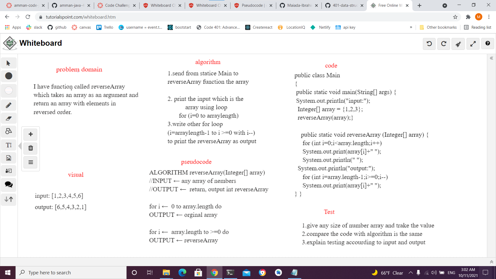

# Reverse an Array
Write a function called reverseArray which takes an array as an argument and return an array with elements in reversed order.

## Whiteboard Process

## Approach & Efficiency
it take two hour becuase  it first time it must take half hour 