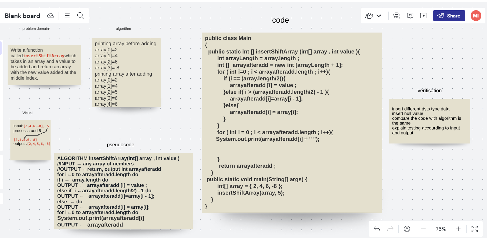

insertShiftArray
Write a function calledinsertShiftArraywhich takes in an array and a value to be added and return an array with the new value added at the middle index.

Whiteboard Process

Approach & Efficiency
I was creating a new array and insirt the new value in the midlle of the new one in addition to reblace rest items by the oldest array items.

