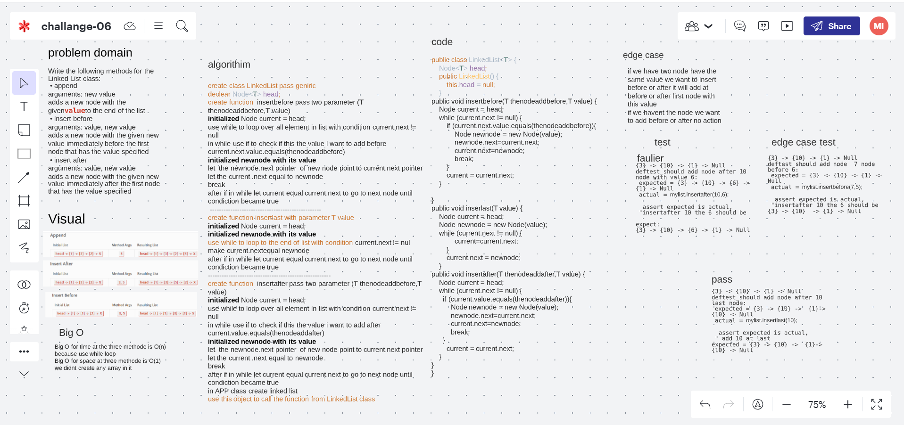

# Challenge Summary
Write the following methods for the Linked List class:
append
arguments: new value
adds a new node with the givenvalueto the end of the list
insert before
arguments: value, new value
adds a new node with the given new value immediately before the first node that has the value specified
insert after
arguments: value, new value
adds a new node with the given new value immediately after the first node that has the value specified

## Whiteboard Process

## Approach & Efficiency
append-insert before-insert after
Big O for time at the three methode is O(n)
because use while loop
Big O for space at three methode is O(1)
we didnt create any array in it 

## Solution
{3} -> {10} -> {1} -> Null 
deftest_should add node after 10 last node:
 expected = {3} -> {10} ->  {1}->  {10} -> Null   
 actual = mylist.insertlast(10);  
  assert expected is actual,
 " add 10 at last
expected = {3} -> {10} ->  {1}->  {10} -> Null

## link
https://github.com/Maiada-Ibrahim/data-structures-and-algorithms-401/tree/main/testchallange/challange-06