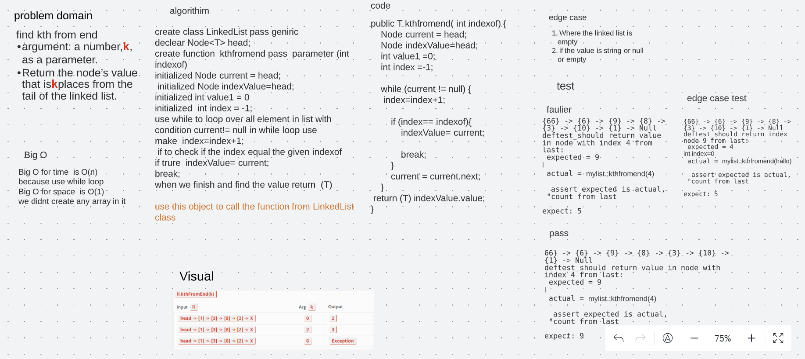

# Challenge Summary
find kth from end
argument: a number,k, as a parameter.
Return the node’s value that iskplaces from the tail of the linked list

## Whiteboard Process

## Approach & Efficiency
Big O for time  is O(n)
because use while loop
Big O for space  is O(1)
we didnt create any array in it 

## Solution

66} -> {6} -> {9} -> {8} -> {3} -> {10} -> {1} -> Null 
deftest_should return value in node with index 4 from last:
 expected = 9  
 actual = mylist.kthfromend(4)  
  assert expected is actual,
 "count from last 4 index and return value"

expect: 9
 
   
 
## link
https://github.com/Maiada-Ibrahim/data-structures-and-algorithms-401/tree/main/testchallange/challange-07