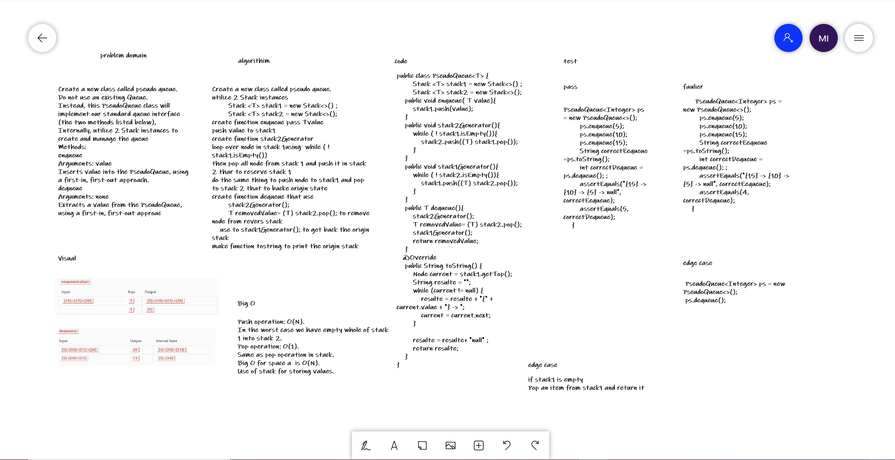

# Challenge Summary
Create a new class called pseudo queue.
Do not use an existing Queue.
Instead, this PseudoQueue class will implement our standard queue interface (the two methods listed below),
Internally, utilize 2 Stack instances to create and manage the queue
Methods:
enqueue
Arguments: value
Inserts value into the PseudoQueue, using a first-in, first-out approach.
dequeue
Arguments: none
Extracts a value from the PseudoQueue, using a first-in, first-out approac

## Whiteboard Process
 

## Approach & Efficiency
deQueue(q):Big O is : O(1).

enqueue : Big O is : O(n).

## Solution
While stack1 is not empty, push everything from stack1 to stack2.

Push x to stack1 (assuming size of stacks is unlimited).

reserve stack 1 do dequeue

Push everything back to stack1.

## link
[link for code](https://github.com/Maiada-Ibrahim/data-structures-and-algorithms-401/tree/main/challenges/challenge-10)