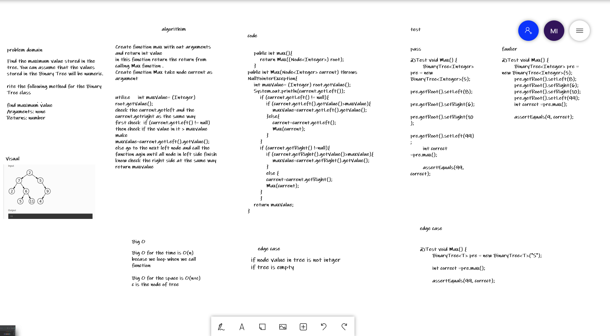

# Challenge Summary
Find the maximum value stored in the tree. You can assume that the values stored in the Binary Tree will be numeric.

rite the following method for the Binary Tree class

find maximum value
Arguments: none
Returns: number
## Whiteboard Process
 

## Approach & Efficiency
Big O for the time is O(n)
becase we loop when we call function

Big O for the space is O(n+c)
c is the node of tree

## Solution
we check all node vallue if it grater than max value and get the max value using bainary tree
using recursive method

## link
[link for code](https://github.com/Maiada-Ibrahim/data-structures-and-algorithms-401/tree/main/challenges/challenge-15)