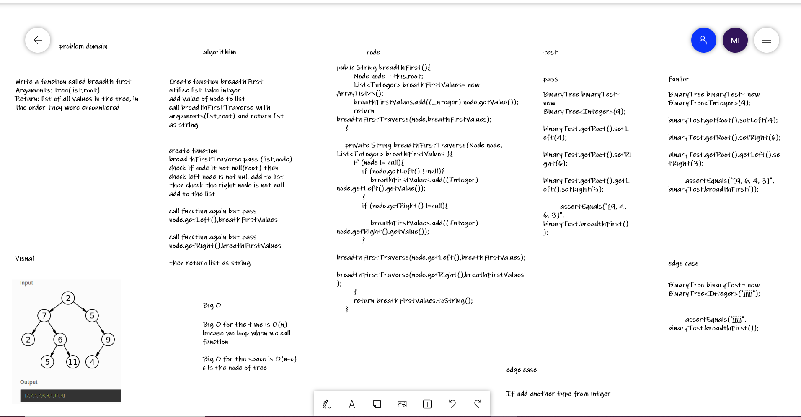

# Challenge Summary
Write a function called breadth first
Arguments: tree(list,root)
Return: list of all values in the tree, in the order they were encountered
## Whiteboard Process
 

## Approach & Efficiency
Big O for the time is O(n)
becase we loop when we call function

Big O for the space is O(n+c)
c is the node of tree

## Solution
check node and then check the left and right node for this node  after that call function again with the left node 
call function again with the right node 

## link
[link for code](https://github.com/Maiada-Ibrahim/data-structures-and-algorithms-401/tree/main/challenges/challenge-15)