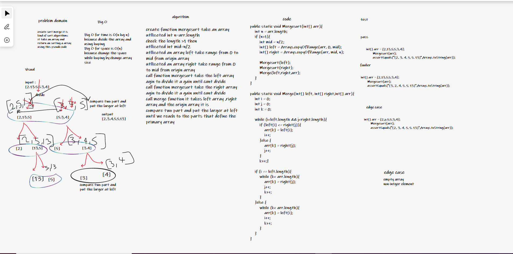

# Challenge Summary
Review the pseudocode below, then trace the algorithm by stepping through the process with the provided sample array.

ALGORITHM Mergesort(arr)
    DECLARE n <-- arr.length

    if n > 1
      DECLARE mid <-- n/2
      DECLARE left <-- arr[0...mid]
      DECLARE right <-- arr[mid...n]
      // sort the left side
      Mergesort(left)
      // sort the right side
      Mergesort(right)
      // merge the sorted left and right sides together
      Merge(left, right, arr)

ALGORITHM Merge(left, right, arr)
    DECLARE i <-- 0
    DECLARE j <-- 0
    DECLARE k <-- 0

    while i < left.length && j < right.length
        if left[i] <= right[j]
            arr[k] <-- left[i]
            i <-- i + 1
        else
            arr[k] <-- right[j]
            j <-- j + 1

        k <-- k + 1

    if i = left.length
       set remaining entries in arr to remaining values in right
    else
       set remaining entries in arr to remaining values in left

sample Array : [8,4,23,42,16,15]

# Whiteboard Process

# Approach & Efficiency
the call merge function call his self to divide the arrays
compare two part and put the larger at left
until we reach to the parts that define the primary array, so time complixity is O(n log n) and space complixity O(1).

# Solution
TTo run the server application,

clone down this repo.

'cd' into the cloned repository in your terminal

Make sure you have modified the applicaton.properties file with your own environment variables:

To run this code you can either run the App.java file inside src/main/java/challenge/App, which contains  array samples to run the merge sort method on, or you can simple run the AppTest.java file which contains multiple tests to test our method.

input :int[] array4 = {2,3,5,7,13,11};
output:[2, 3, 5, 7, 11, 13]

[link challange-26](https://github.com/Maiada-Ibrahim/data-structures-and-algorithms-401/tree/main/challenges/challenge-27)