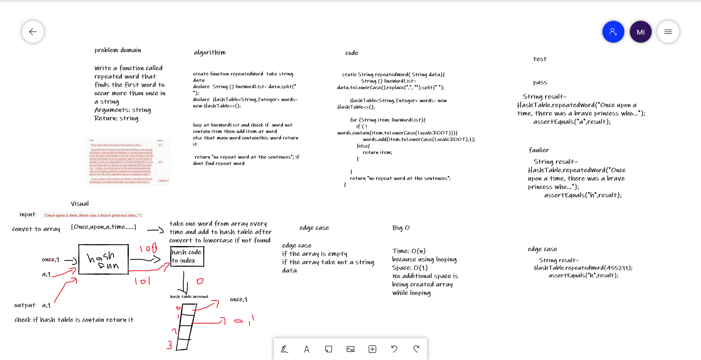

# Challenge Summary
Write a function called repeated word that finds the first word to occur more than once in a string
Arguments: string
Return: string
## Whiteboard Process
 

## Approach & Efficiency
Time: O(n)
because using looping
Space: O(1)
No additional space is being created array while looping

## Solution
To run the server application,

clone down this repo.

'cd' into the cloned repository in your terminal

To run this code you can either run the App.java file inside src/main/java/challenges/challenge-31, which contains test

## link
[link for code](https://github.com/Maiada-Ibrahim/data-structures-and-algorithms-401/tree/main/challenges/challenge-30)