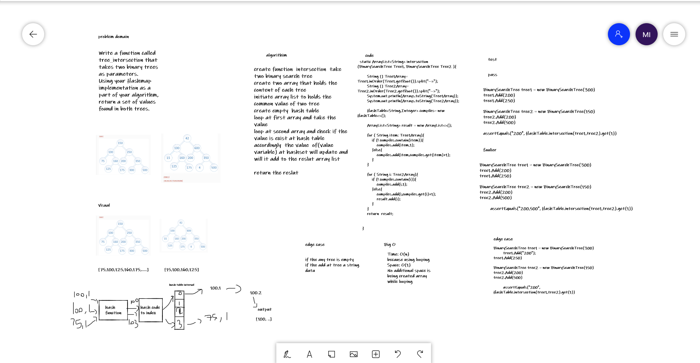

# Challenge Summary
Write a function called tree_intersection that takes two binary trees as parameters.
Using your Hashmap implementation as a part of your algorithm, return a set of values found in both trees.
## Whiteboard Process
 

## Approach & Efficiency
Time: O(n) it is O(2n)
because using looping but we say O(n)
Space: O(1)
No additional space is being created array while looping

## Solution
To run the server application,

clone down this repo.

'cd' into the cloned repository in your terminal

To run this code you can either run the App.java file inside src/main/java/challenges/challenge-32, which contains test

## link
[link for code](https://github.com/Maiada-Ibrahim/data-structures-and-algorithms-401/tree/main/challenges/challenge-32)