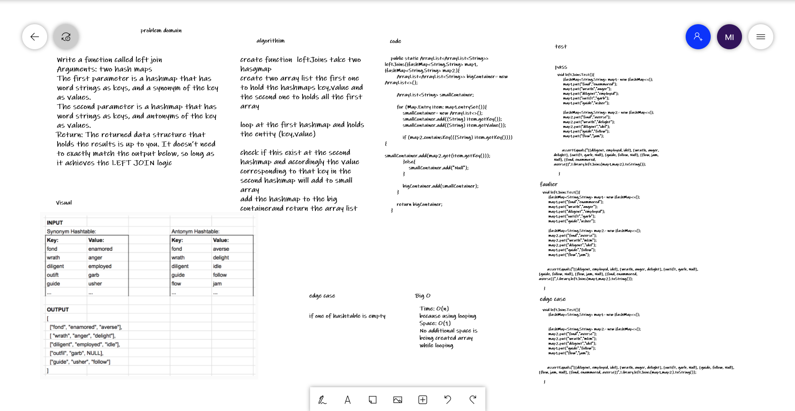

# Challenge Summary
Write a function called left join
Arguments: two hash maps
The first parameter is a hashmap that has word strings as keys, and a synonym of the key as values.
The second parameter is a hashmap that has word strings as keys, and antonyms of the key as values.
Return: The returned data structure that holds the results is up to you. It doesn’t need to exactly match the output below, so long as it achieves the LEFT JOIN logic
## Whiteboard Process
 

## Approach & Efficiency
Time: O(n)
because using looping
Space: O(1)
No additional space is being created array while looping

## Solution
To run the server application,

clone down this repo.

'cd' into the cloned repository in your terminal

To run this code you can either run the App.java file inside src/main/java/challenges/challenge-31, which contains test

## link
[link for code](https://github.com/Maiada-Ibrahim/data-structures-and-algorithms-401/tree/main/challenges/challenge-32)