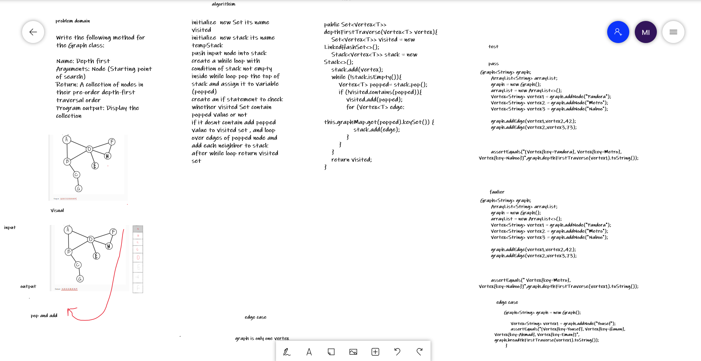

# Depth First Traversal
## Challenge
Write the following method for the Graph class:

Name: Depth first
Arguments: Node (Starting point of search)
Return: A collection of nodes in their pre-order depth-first traversal order
Program output: Display the collection
## Whiteboard Process

## Approach & Efficiency
 Time complexity O(n^2) because we use nested loop, 
 space complexity O(n)  change space until looping

## Solution
To run the server application,

clone down this repo.

'cd' into the cloned repository in your terminal

Make sure you have modified the applicaton.properties file with your own environment variables:

To run this code you can either run the App.java file inside src/main/java/challenge/Library, which contains four array samples to run the insertion sort method on, or you can simple run the AppTest.java file which contains multiple tests to test our method.

## link
[link for code](https://github.com/Maiada-Ibrahim/data-structures-and-algorithms-401/tree/main/challenges/challenge-35)